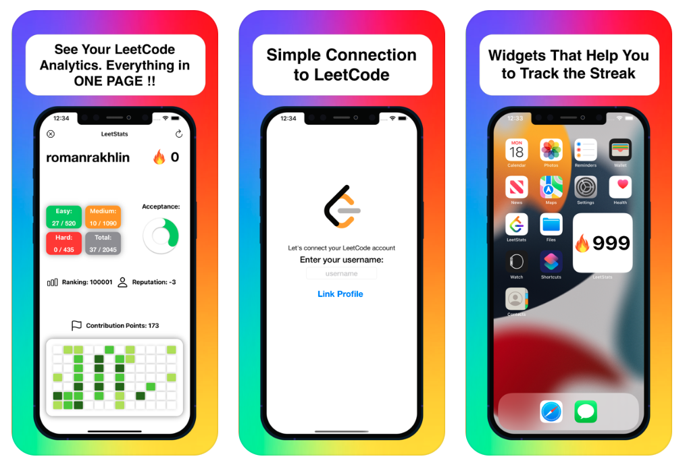

# LeetStats

App that works with LeetCode.com and shows Statistics in there.

## Thanks to

Thanks a lot to this guy and his api - https://github.com/JeremyTsaii/leetcode-stats-api

Without it I would never created this app!

## Screenshots

## License
LeetStats is available under the MIT license. See the LICENSE file for more info.
